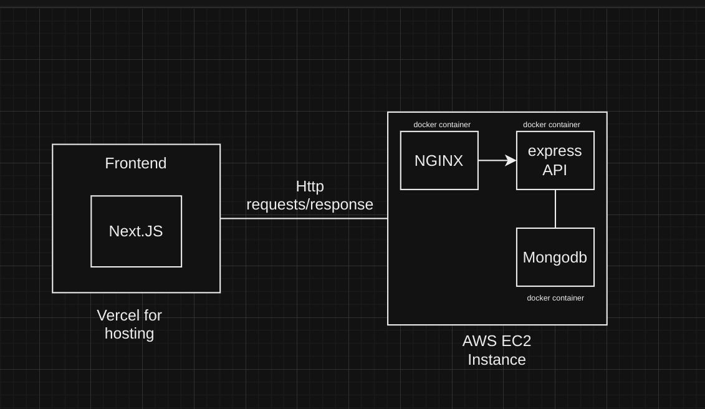

## Tech Stack

- **Frontend:** React, TailwindCSS, MantineUI Library
- **Backend:** Node.js, Express , TypeScript 
- **Database:** MongoDB  
- **Others:** Docker, Nginx

## Overview
Frontend Next.js app hosted on Vercel consumes Express REST API hosted on AWS EC2 and served by Nginx web server

## Diagram
